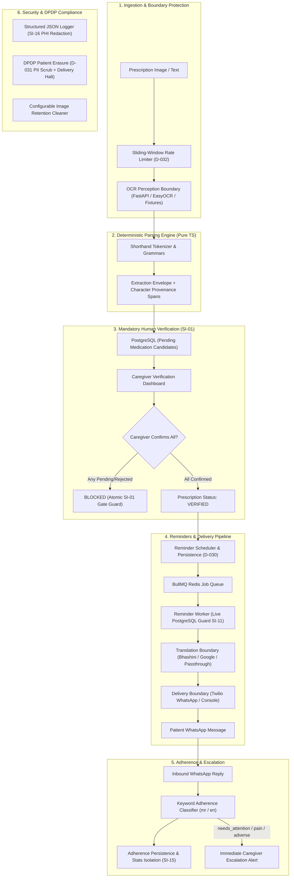

# PrescriptionSetu (प्रिस्क्रिप्शन सेतू)

> **Safety-focused, AI-assisted prescription translation and medication reminder backend with mandatory human verification.**

PrescriptionSetu turns a photographed prescription into actionable, scheduled medication reminders for elderly, Marathi-speaking patients. It bridges the gap between clinical shorthand and patient adherence by combining OCR perception, **deterministic rule-based shorthand parsing**, **mandatory human verification**, multi-lingual translation, scheduled WhatsApp reminders, and bi-directional adherence tracking with caregiver escalation.

---

## 1. Safety Architecture: The Mandatory Verification Gate

> **NON-NEGOTIABLE SAFETY INVARIANT (SI-01):**
> **No dosage, frequency, or timing instruction may reach a patient without explicit human confirmation first.**
>
> A `prescriptions` record must never transition to `status = 'verified'` while any associated `medications` candidate remains in `pending` or `rejected` status. This rule is enforced as an atomic database transaction guard in backend code (`src/verification/gate.ts`), not as a user interface convention.

The platform explicitly recognizes the limits of automated perception:
- **OCR perception is probabilistic and untrusted.** Image noise, doctor handwriting, and font variations mean OCR text cannot be treated as ground truth.
- **Human verification is mandatory.** A human caregiver or verifier must explicitly review every candidate medication, verify extracted fields against the source prescription, and confirm or correct the clinical directives before any reminder can be scheduled.
- **The system guarantees human review took place, not that the human was clinically infallible.** The residual risk of untrained caregiver error is treated as a documented operational reality rather than glossed over.

---

## 2. End-to-End System Architecture



---

## 3. Deterministic Parsing vs. Generative LLMs

A foundational design decision in PrescriptionSetu is the deliberate refusal to use generative Large Language Models (LLMs) for clinical shorthand extraction.

```
┌──────────────────────────────────────┬──────────────────────────────────────┐
│   Deterministic Rule-Based Parser    │      Generative LLM Extraction       │
├──────────────────────────────────────┼──────────────────────────────────────┤
│ ✓ 100% Repeatable & deterministic    │ ✗ Non-deterministic output variation │
│ ✓ Exact character source_span offsets│ ✗ Hallucinated or approximate spans  │
│ ✓ Mathematically auditable rules     │ ✗ Generative dosing hallucinations   │
│ ✓ No model drift in extraction layer │ ✗ Susceptible to prompt drift & temp │
│ ✓ Sub-millisecond local execution    │ ✗ Multi-second network latency       │
│ ✓ Zero PHI sent to external AI APIs  │ ✗ Patient data privacy exposure      │
└──────────────────────────────────────┴──────────────────────────────────────┘
```

### Architectural & Clinical Rationale:
1. **Prevention of Generative Hallucination:** Medical prescription abbreviations (`BD`, `TDS`, `1 tab`, `500 mg`, `10 ml`) carry rigid clinical definitions. The deterministic parser (`src/parser/`) uses an explicit grammar dictionary (`docs/SHORTHAND_DICTIONARY.md`). It either matches an authorized clinical pattern or flags `verifier_action_required: true`. Because it does not use generative inference, it cannot invent dosage amounts, frequencies, or timing anchors absent from the input.
2. **Mathematically Auditable Provenance:** Every extracted token preserves exact Unicode code-point offsets (`source_span: { start, end }`) resolving against `prescriptions.raw_ocr_text` and references the matched rule ID (e.g. `FREQ-BD-001`, `AMT-TAB-001`). This enables the verification dashboard to visually map extracted values directly to the corresponding segment of the original prescription for human review.
3. **Where AI Belongs vs Where It Is Banned:**
   - **Perception (Statistical AI):** OCR image-to-text conversion is inherently probabilistic. OCR output is treated strictly as *untrusted perception text* that must pass through deterministic grammar validation.
   - **Adherence Fallback (Secondary AI):** An explicit keyword matching engine handles inbound patient confirmations in Marathi and English. LLMs are restricted strictly to analyzing ambiguous replies, safely routing to `needs_attention` for human escalation.
   - **Prohibited AI Role:** LLMs are **strictly prohibited** from directly generating medication schedules or bypassing the human verification gate.

---

## 4. Key Subsystems & Safety Invariants

### A. Verification Gate & Clinical Lifecycle (`src/verification/`)
- **SI-01 Verification Gate:** Prescriptions transition to `verified` only when every constituent medication candidate is explicitly confirmed or corrected by a human.
- **SI-08 Safety Ceilings:** Parser rules enforce hard ceiling bounds on frequency and dosage amount (e.g., maximum 4 daily doses without manual override).
- **SI-10 & SI-11 Delivery Double-Check:** Stopping a medication immediately transitions pending reminders to `cancelled`. Prior to sending every message, the background worker performs an atomic query against live PostgreSQL state to prevent delivering stopped or superseded medications.
- **SI-14 Clinical Audit Trail:** All medication edits, confirmations, rejections, stops, and erasure events append immutable records to `medication_audit_events`.

### B. Reminder Scheduler & BullMQ Worker (`src/reminders/`)
- Pure `scheduleReminders()` calculates meal-relative notification timestamps (morning, afternoon, night, bedtime) anchored to patient meal times in `Asia/Kolkata` (`+05:30` IST).
- Reminders are persisted using a provider-neutral **JSONB discriminated union** (Decision **D-030**: `rendered_text` vs `template`).
- Jobs are enqueued into **BullMQ / Redis** with exponential backoff and retry eligibility guards.

### C. Translation & WhatsApp Delivery Providers (`src/translation/`, `src/delivery/`)
- **Translation Provider Seam:** Pluggable interface supporting `BhashiniProvider` (Government of India ULCA NMT format), `GoogleTranslateProvider`, and `PassthroughProvider`.
- **Delivery Provider Seam:** Pluggable interface supporting `TwilioSandboxProvider` (session-based rendered text for dev/testing), `TwilioProductionProvider` (Meta-compliant pre-approved WhatsApp templates with ordered variables), and local `ConsoleProvider`.

### D. Adherence Tracking & Caregiver Escalation (`src/adherence/`)
- Pure keyword classifier supporting **English**, **Marathi Devanagari** (e.g., `"घेतली"`, `"नाही"`, `"त्रास"`), and **Romanized Marathi** (e.g., `"ghetli"`, `"nahit"`, `"tras"`).
- **Safety Precedence & Stats Isolation (SI-15):** Any reply indicating pain, discomfort, adverse reaction, or ambiguity is classified as `needs_attention`, immediately isolated from numerical adherence percentage statistics, and triggers an urgent escalation alert to the caregiver.

### E. Hardening, DPDP Governance & Ingestion Abuse Protection
- **SI-16 Structured Logging & PHI Redaction (`src/logging/`):** Centralized structured JSON logger enforces an explicit allow-list of safe operational metadata keys (`prescription_id`, `medication_id`, `reminder_id`, `patient_id`, `caregiver_id`, `error_code`, `status_code`, etc.). Raw OCR text, prescription contents, drug names, patient names, and phone numbers are never written to plaintext logs or error traces.
- **DPDP Act 2023 Patient Erasure (Decision D-031, `src/retention/`):** `DELETE /api/patients/:id` executes an atomic transactional PII scrub (`full_name = '[DELETED_PATIENT]'`, `phone_number = NULL`), immediately halts pending outbound reminder delivery, stops active medications with audit events, unlinks caregivers, and purges image keys while preserving provenance offsets.
- **Configurable Prescription Image Retention:** Background cleaner (`cleanupExpiredPrescriptionImages()`) purges raw image keys for verified prescriptions (defaulting to a 30-day engineering configuration), keeping unverified prescriptions and OCR text intact.
- **Upload Rate Limiting (Decision D-032, `src/middleware/rate-limiter.ts`):** Sliding-window in-memory rate limiter on `POST /api/prescriptions/upload` (default 10 requests / 60 seconds per client key) returns HTTP **429 Too Many Requests** with `Retry-After` header, halting abusive ingestion loops before OCR or database processing.

---

## 5. Repository Structure

```
PrescriptionSetu/
├── apps/
│   ├── api/                  # Node.js / Express / TypeScript backend
│   │   ├── src/
│   │   │   ├── adherence/    # Adherence classifier, persistence & caregiver escalation
│   │   │   ├── db/           # Knex migrations, connection & repository layer
│   │   │   ├── delivery/     # MessageProvider interface & Twilio / Console implementations
│   │   │   ├── logging/      # SI-16 structured JSON logger & safe key allow-listing
│   │   │   ├── middleware/   # Sliding-window upload rate limiter
│   │   │   ├── ocr/          # OCR perception boundary & fixture provider
│   │   │   ├── parser/       # Deterministic shorthand tokenizer, grammar & rules
│   │   │   ├── reminders/    # Pure scheduler, BullMQ queue & background worker
│   │   │   ├── retention/    # DPDP patient erasure & configurable image retention
│   │   │   ├── routes/       # Express route handlers (prescriptions, medications, etc.)
│   │   │   ├── translation/  # TranslationProvider interface, Bhashini & Google Translate
│   │   │   └── verification/ # Verification gate, stop lifecycle & dashboard display
│   │   └── tests/            # 46 Jest integration & unit test suites (535 tests)
│   ├── ocr-service/          # Python / FastAPI EasyOCR microservice
│   └── dashboard/            # Next.js verification dashboard
├── docs/
│   ├── API_CONTRACTS.md      # Node.js ↔ Python & external provider contracts
│   ├── DECISIONS.md          # Architecture Decision Records (D-001 through D-032)
│   ├── SCHEMA.md             # Canonical PostgreSQL relational schema specification
│   └── SHORTHAND_DICTIONARY.md # Formal medical shorthand grammar & token rules
├── AGENTS.md                 # Canonical instructions for AI coding agents
├── BUILD_ORDER.md            # Verified execution order across all project steps
├── HANDOFF.md                # Volatile project state & active cursor
├── SAFETY_INVARIANTS.md      # Non-negotiable clinical safety invariants
└── docker-compose.yml        # PostgreSQL 16 & Redis 7 container orchestration
```

---

## 6. Verification Baseline & Test Reproduction

The backend is strictly verified with comprehensive automated unit, integration, and regression test suites.

### Verified Baseline Metrics:
- **Test Suites:** **46 passed**, 46 total
- **Tests:** **535 passed**, 535 total (0 failed, 0 skipped)
- **TypeScript:** `npm run typecheck` passes with **0 errors**.

### Local Setup & Test Execution Guide:

```bash
# 1. Start PostgreSQL 16 and Redis 7
docker compose up -d

# 2. Navigate to API workspace
cd apps/api

# 3. Install dependencies
npm install

# 4. Run database migrations
npm run migrate:latest

# 5. Typecheck TypeScript codebase
npm run typecheck

# 6. Execute full regression test suite (run in-band for database isolation)
npm test -- --runInBand --detectOpenHandles
```

---

## 7. Project Status & Documentation Map

- **Current Project Status:** **Safety-Focused MVP Backend & Verification Engine (Steps 1 through 8 of BUILD_ORDER.md Complete)**.
- **Canonical Agent Instructions:** `AGENTS.md` is the primary instruction file for all AI coding agents.
- **Single Volatile State File:** `HANDOFF.md` records live progress, verified baselines, and upcoming tasks.

---

## 8. Next Milestones

With all 8 backend steps of `BUILD_ORDER.md` fully implemented and verified:
1. **Prescription Corpus Curation (`BUILD_ORDER.md` §2.1):** Assemble 25–30 synthetic printed prescription samples for end-to-end benchmarking.
2. **External Platform Onboarding:** Submit Government of India Bhashini API application and configure WhatsApp Business Account (WABA) template registration.
3. **Frontend Dashboard Integration (`apps/dashboard`):** Connect Next.js verification interface to API endpoints (`/api/prescriptions/pending`, `/api/prescriptions/:id`, `/api/medications/:id/confirm`).